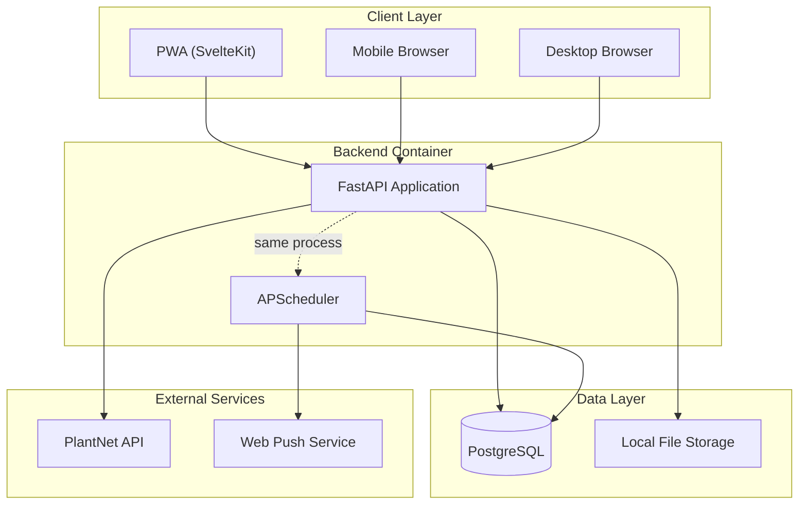
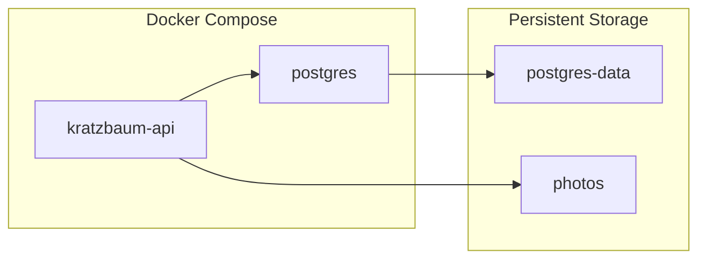
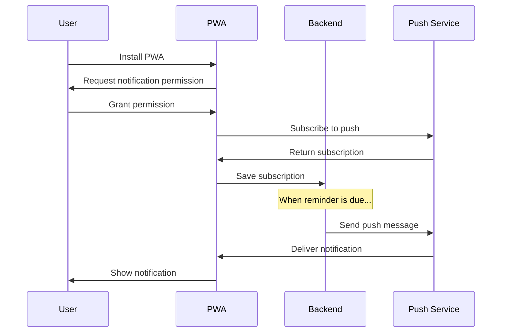

# Architecture Diagram

## System Overview



---

## Component Details

### Client Layer
| Component | Technology | Purpose |
|-----------|------------|---------|
| PWA | SvelteKit | Progressive Web App installable on iPhone |
| Browsers | Any modern browser | Web access from desktop/mobile |

### Backend Services
| Component | Technology | Purpose |
|-----------|------------|---------|
| FastAPI | Python 3.11 + FastAPI | REST API server |
| APScheduler | APScheduler 3.x | In-process job scheduler |

### Data Layer
| Component | Technology | Purpose |
|-----------|------------|---------|
| PostgreSQL | PostgreSQL 15 | Primary database + scheduler job store |
| File Storage | Local volume | Photo storage (mounted volume) |

---

## Simplified Deployment



> [!NOTE]
> **Why APScheduler instead of Celery?**
> - Single container deployment (no Redis, no separate worker)
> - Job state persisted in PostgreSQL
> - Perfect for single-user, < 100 plants
> - Can upgrade to Celery later if needed

---

## Container Structure

```
kratzbaum/
├── docker-compose.yml           # Full stack deployment
├── backend/
│   ├── Dockerfile
│   ├── app/
│   │   ├── main.py              # FastAPI app + scheduler init
│   │   ├── api/                 # API routes
│   │   ├── models/              # SQLModel models
│   │   ├── services/            # Business logic
│   │   ├── scheduler/           # APScheduler jobs
│   │   └── core/                # Config, auth, deps
│   └── pyproject.toml
└── frontend/
    ├── Dockerfile
    └── src/
```

---

## Scheduler Architecture (APScheduler)

```python
from apscheduler.schedulers.asyncio import AsyncIOScheduler
from apscheduler.jobstores.sqlalchemy import SQLAlchemyJobStore
from apscheduler.triggers.cron import CronTrigger

# Initialize with PostgreSQL job store
scheduler = AsyncIOScheduler(
    jobstores={
        'default': SQLAlchemyJobStore(url=DATABASE_URL)
    }
)

# Check for due reminders every minute
scheduler.add_job(
    check_due_reminders,
    CronTrigger(minute='*'),
    id='reminder_checker',
    replace_existing=True
)
```

### How Reminders Work
1. User creates reminder → saved to `reminders` table with `next_due` timestamp
2. Scheduler job runs every minute
3. Queries `SELECT * FROM reminders WHERE next_due <= NOW() AND is_enabled = TRUE`
4. Sends push notification for each due reminder
5. Reschedules `next_due` based on frequency

---

## Push Notifications (PWA)



### Libraries
- **Backend**: `pywebpush` for sending notifications
- **Frontend**: Service Worker + Push API

---

## Security Considerations

1. **Authentication Flow**
   - Username/password login → JWT token
   - Token stored in httpOnly cookie
   - Token refresh mechanism
   - Extensible to OAuth/social login

2. **API Security**
   - Input validation with Pydantic
   - SQL injection prevention via SQLModel
   - CORS configured for PWA origin

3. **File Upload Security**
   - File type validation (images only)
   - Max file size limit (10MB)
   - Sanitized file names
