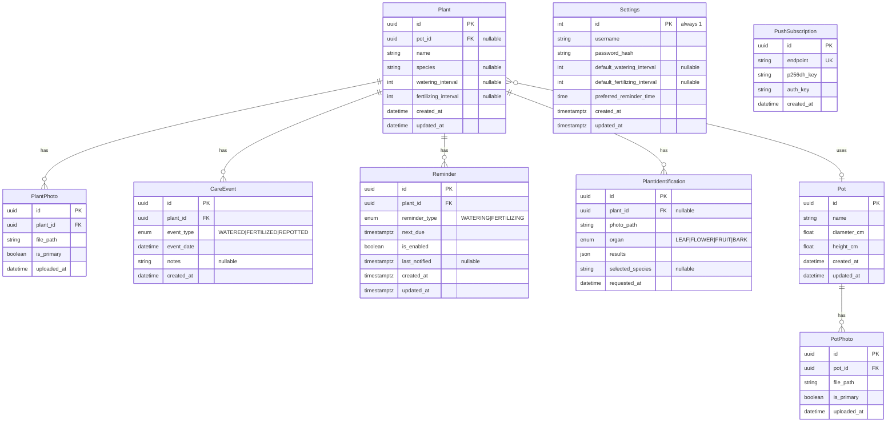

# Database Schema

## Entity Relationship Diagram



> [!NOTE]
> **Single-User Design**: No `user_id` foreign keys needed. A single `Settings` row stores auth credentials.

---

## Table Definitions

### settings
| Column | Type | Constraints | Description |
|--------|------|-------------|-------------|
| id | INTEGER | PK, DEFAULT 1 | Always 1 (singleton) |
| username | VARCHAR(50) | NOT NULL | Login username |
| password_hash | VARCHAR(255) | NOT NULL | bcrypt hashed password |
| default_watering_interval | INTEGER | NULLABLE | Default days between watering |
| default_fertilizing_interval | INTEGER | NULLABLE | Default days between fertilizing |
| preferred_reminder_time | TIME | NOT NULL, DEFAULT '09:00' | When to send notifications |
| created_at | TIMESTAMPTZ | NOT NULL, DEFAULT NOW() | Creation timestamp |
| updated_at | TIMESTAMPTZ | NOT NULL, DEFAULT NOW() | Last update timestamp |

### push_subscriptions
| Column | Type | Constraints | Description |
|--------|------|-------------|-------------|
| id | UUID | PK | Primary key |
| endpoint | VARCHAR(500) | UNIQUE, NOT NULL | Push service endpoint URL |
| p256dh_key | VARCHAR(255) | NOT NULL | Client public key |
| auth_key | VARCHAR(255) | NOT NULL | Auth secret |
| created_at | TIMESTAMPTZ | NOT NULL | When subscription was created |

### plants
| Column | Type | Constraints | Description |
|--------|------|-------------|-------------|
| id | UUID | PK | Primary key |
| pot_id | UUID | FK → pots.id, NULLABLE | Assigned pot |
| name | VARCHAR(100) | NOT NULL | User-defined name |
| species | VARCHAR(200) | NULLABLE | Scientific/common name |
| watering_interval | INTEGER | NULLABLE | Custom watering interval in days |
| fertilizing_interval | INTEGER | NULLABLE | Custom fertilizing interval in days |
| created_at | TIMESTAMPTZ | NOT NULL | Creation timestamp |
| updated_at | TIMESTAMPTZ | NOT NULL | Last update timestamp |

### plant_photos
| Column | Type | Constraints | Description |
|--------|------|-------------|-------------|
| id | UUID | PK | Primary key |
| plant_id | UUID | FK → plants.id, ON DELETE CASCADE | Parent plant |
| file_path | VARCHAR(500) | NOT NULL | Path to stored file |
| is_primary | BOOLEAN | NOT NULL, DEFAULT FALSE | Thumbnail flag |
| uploaded_at | TIMESTAMPTZ | NOT NULL | Upload timestamp |

### care_events
| Column | Type | Constraints | Description |
|--------|------|-------------|-------------|
| id | UUID | PK | Primary key |
| plant_id | UUID | FK → plants.id, ON DELETE CASCADE | Parent plant |
| event_type | VARCHAR(20) | NOT NULL, CHECK IN (...) | WATERED, FERTILIZED, REPOTTED |
| event_date | TIMESTAMPTZ | NOT NULL | When event occurred |
| notes | TEXT | NULLABLE | Optional notes |
| created_at | TIMESTAMPTZ | NOT NULL | Record creation |

### pots
| Column | Type | Constraints | Description |
|--------|------|-------------|-------------|
| id | UUID | PK | Primary key |
| name | VARCHAR(100) | NOT NULL | User-defined name |
| diameter_cm | DECIMAL(5,1) | NOT NULL | Diameter in cm |
| height_cm | DECIMAL(5,1) | NOT NULL | Height in cm |
| created_at | TIMESTAMPTZ | NOT NULL | Creation timestamp |
| updated_at | TIMESTAMPTZ | NOT NULL | Last update timestamp |

### pot_photos
| Column | Type | Constraints | Description |
|--------|------|-------------|-------------|
| id | UUID | PK | Primary key |
| pot_id | UUID | FK → pots.id, ON DELETE CASCADE | Parent pot |
| file_path | VARCHAR(500) | NOT NULL | Path to stored file |
| is_primary | BOOLEAN | NOT NULL, DEFAULT FALSE | Thumbnail flag |
| uploaded_at | TIMESTAMPTZ | NOT NULL | Upload timestamp |

### reminders
| Column | Type | Constraints | Description |
|--------|------|-------------|-------------|
| id | UUID | PK | Primary key |
| plant_id | UUID | FK → plants.id, ON DELETE CASCADE | Parent plant |
| reminder_type | VARCHAR(20) | NOT NULL | WATERING or FERTILIZING |
| next_due | TIMESTAMPTZ | NOT NULL | Next scheduled notification |
| is_enabled | BOOLEAN | NOT NULL, DEFAULT TRUE | Active flag |
| last_notified | TIMESTAMPTZ | NULLABLE | Last time a notification was sent |
| created_at | TIMESTAMPTZ | NOT NULL | Creation timestamp |
| updated_at | TIMESTAMPTZ | NOT NULL | Last update timestamp |

### plant_identifications
| Column | Type | Constraints | Description |
|--------|------|-------------|-------------|
| id | UUID | PK | Primary key |
| plant_id | UUID | FK → plants.id, NULLABLE | Associated plant |
| photo_path | VARCHAR(500) | NOT NULL | Photo used |
| organ | VARCHAR(20) | NOT NULL | LEAF, FLOWER, FRUIT, BARK |
| results | JSONB | NOT NULL | PlantNet API response |
| selected_species | VARCHAR(200) | NULLABLE | User-selected species |
| requested_at | TIMESTAMPTZ | NOT NULL | Request timestamp |

---

## Indexes

```sql
-- Performance indexes
CREATE INDEX idx_plants_pot_id ON plants(pot_id);
CREATE INDEX idx_plants_name ON plants(name);  -- For search
CREATE INDEX idx_plant_photos_plant_id ON plant_photos(plant_id);
CREATE INDEX idx_care_events_plant_id ON care_events(plant_id);
CREATE INDEX idx_care_events_event_date ON care_events(event_date DESC);
CREATE INDEX idx_reminders_plant_id ON reminders(plant_id);
CREATE INDEX idx_reminders_next_due ON reminders(next_due) WHERE is_enabled = TRUE;
```

---

## SQLModel Examples

```python
from sqlmodel import SQLModel, Field, Relationship
from uuid import UUID, uuid4
from datetime import datetime, time
from typing import Optional, List
from enum import Enum

class CareEventType(str, Enum):
    WATERED = "WATERED"
    FERTILIZED = "FERTILIZED"
    REPOTTED = "REPOTTED"

class ReminderType(str, Enum):
    WATERING = "WATERING"
    FERTILIZING = "FERTILIZING"

class FrequencyType(str, Enum):
    DAILY = "DAILY"
    INTERVAL = "INTERVAL"
    WEEKLY = "WEEKLY"
    SPECIFIC_DAYS = "SPECIFIC_DAYS"


class Settings(SQLModel, table=True):
    """Single-user settings and auth (singleton row)."""
    __tablename__ = "settings"
    
    id: int = Field(default=1, primary_key=True)
    username: str = Field(max_length=50)
    password_hash: str = Field(max_length=255)
    
    default_watering_interval: Optional[int] = Field(default=None)
    default_fertilizing_interval: Optional[int] = Field(default=None)
    preferred_reminder_time: time = Field(default=time(9, 0))
    
    created_at: datetime = Field(default_factory=lambda: datetime.now(UTC), sa_column=Column(DateTime(timezone=True)))
    updated_at: datetime = Field(default_factory=lambda: datetime.now(UTC), sa_column=Column(DateTime(timezone=True)))


class Reminder(SQLModel, table=True):
    __tablename__ = "reminders"
    
    id: UUID = Field(default_factory=uuid4, primary_key=True)
    plant_id: UUID = Field(foreign_key="plants.id", ondelete="CASCADE")
    reminder_type: ReminderType
    next_due: datetime = Field(sa_column=Column(DateTime(timezone=True)))
    is_enabled: bool = Field(default=True)
    last_notified: Optional[datetime] = Field(default=None, sa_column=Column(DateTime(timezone=True)))
    created_at: datetime = Field(default_factory=lambda: datetime.now(UTC), sa_column=Column(DateTime(timezone=True)))
    updated_at: datetime = Field(default_factory=lambda: datetime.now(UTC), sa_column=Column(DateTime(timezone=True)))
    
    plant: Plant = Relationship(back_populates="reminders")
```
