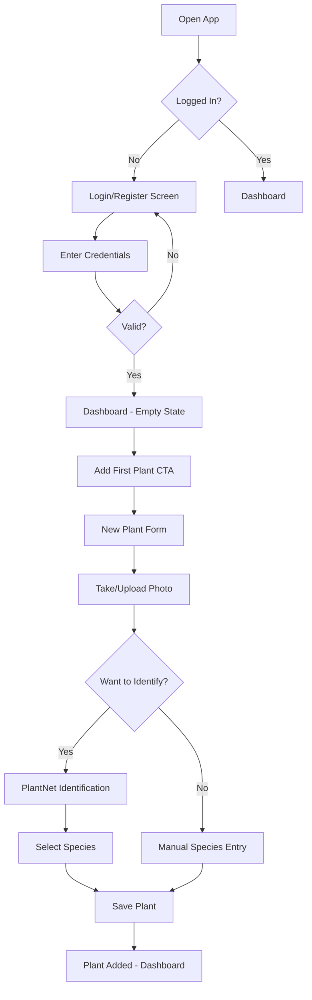
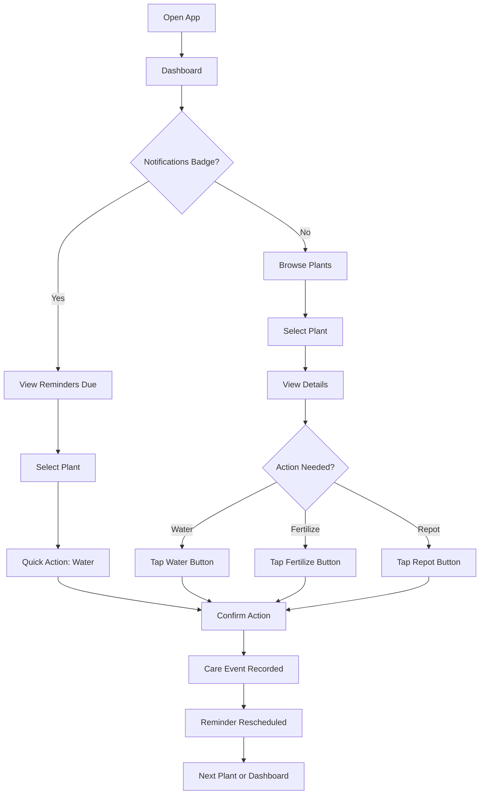
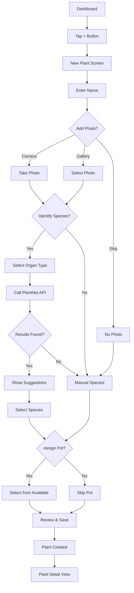
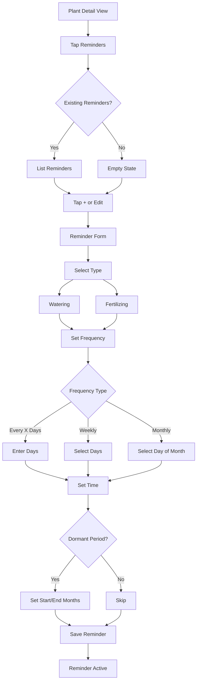
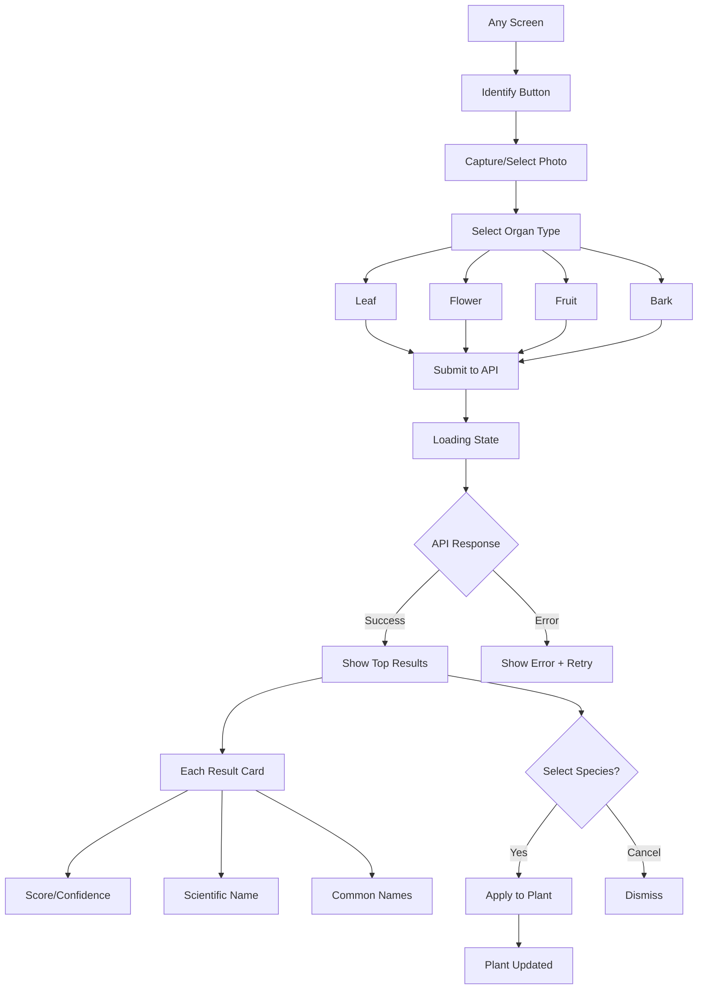

# User Flows

## Overview
This document describes the primary user journeys through the Kratzbaum application.

---

## UF-01: Onboarding & First Plant



---

## UF-02: Daily Plant Care



---

## UF-03: Adding a New Plant



---

## UF-04: Setting Up Reminders



---

## UF-05: Managing Pots

```mermaid
flowchart TD
    A[Bottom Nav: Pots] --> B[Pots List]
    B --> C{Pots Exist?}
    C -->|No| D[Empty State + CTA]
    C -->|Yes| E[Display Grid/List]
    
    D --> F["Add Pot"]
    E --> F
    
    F --> G[Pot Form]
    G --> H[Enter Name]
    H --> I[Enter Dimensions]
    I --> J{Add Photo?}
    J -->|Yes| K[Take/Select Photo]
    J -->|No| L[Skip]
    
    K --> M[Save Pot]
    L --> M
    
    M --> N[Pot Created]
    
    E --> O[Tap Pot]
    O --> P[Pot Detail]
    P --> Q{Assigned to Plant?}
    Q -->|Yes| R[Show Plant Link]
    Q -->|No| S["Available" Status]
    R --> T["Tap Assign/Reassign Plant"]
    S --> T
    T --> U[Assignment Form]
    U --> V[Select Existing Plant or "No plant assigned"]
    V --> W{Selected Plant Already Has Pot?}
    W -->|Yes| X[Show Reassign Warning]
    X --> Y[Confirm Reassignment]
    W -->|No| Z[Save Assignment]
    Y --> Z
    Z --> AA[Pot + Plant Updated]
```

---

## UF-06: Plant Identification



---

## Screen Inventory

| Screen | Description | Key Components |
|--------|-------------|----------------|
| Setup | Initial single-user configuration | Username, password |
| Login | Authentication | Username, password |
| Dashboard | Plant overview | Grid/list view, filter, sort, FAB |
| Plant Detail | Single plant | Photo carousel, care timeline, actions |
| New/Edit Plant | Form | Name, species, photo picker, pot selector |
| Reminders List | All reminders | Grouped by date, quick actions |
| Reminder Form | Create/edit | Type, frequency, time, dormant |
| Pots List | Pot inventory | Grid/list, availability filter |
| Pot Detail | Single pot | Photos, dimensions, plant link, assign/reassign action |
| New/Edit Pot | Form | Name, dimensions, photo picker, existing plant selector |
| Identify | Species ID | Camera, organ selector, results |
| Settings | App settings | Profile, notifications, theme |
